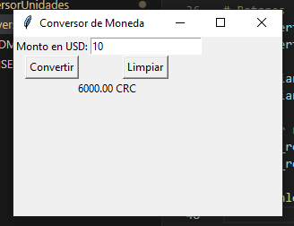
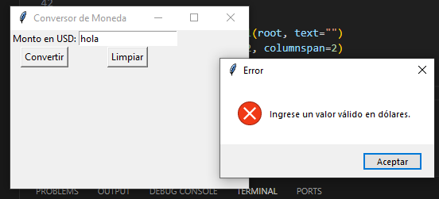

# Conversor de Moneda (USD a CRC)
## Propietario: *Stefanía Ugalde Ramírez*
### 📝 Descripción
Este proyecto consiste en una aplicación gráfica desarrollada en Python utilizando Tkinter que permite convertir montos de **dólares** (USD) a **colones** (CRC). 
### 🛠️ Características Principales

- Conversión de USD a CRC con una tasa fija
- Interfaz gráfica intuitiva
- Validación de entrada de datos
- Función de limpieza de campos
- Confirmación de salida mediante ventana emergente

### 🚀 Requisitos Previos

- Python instalado
- Tkinter (incluido en la instalación estándar de Python)

### ⚙️ Instalación y Ejecución

Clone este repositorio:

```bash
git clone https://github.com/tu_usuario/conversorUnidades.git
```

Navegue al directorio del proyecto:
```bash
cd conversorUnidades
```

Ejecute el script:
```bash
python conversor.py
```
### 💻 Uso de la Aplicación
#### Pasos para realizar una conversión:

1. Ingrese la cantidad en dólares en el campo de entrada
2. Presione el botón "Convertir"
3. El resultado se mostrará en colones costarricenses
4. Use el botón "Limpiar" para reiniciar los campos

### 📸 Ejemplos de Uso
#### 1. Conversión Exitosa


*En esta imagen se muestra una conversión exitosa de 10 USD a CRC*

#### 2. Manejo de Error


*Ejemplo de mensaje de error al ingresar un valor inválido (vacío o no numérico)*

#### 3. Confirmación de Salida


*Ventana emergente de confirmación al intentar cerrar la aplicación*


